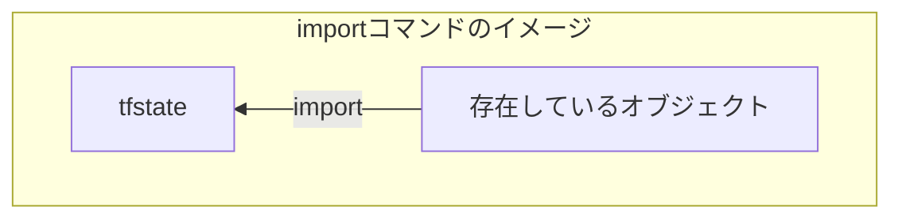

ていねいを心掛けたTerraform記事です。スクリーンショット満載でやった気になれます。
Terraformといえばクラウドリソースの作成ですが、この記事ではローカルPC上のリソース作成で済むように工夫しています。
Terraform関連の他の記事は「[Terraformのきほんと応用](https://zenn.dev/sway/articles/terraform_index_list)」からどうぞ。


## 概要

インフラ管理にTerraformを使用していると、やむにやまれぬ事情で手動で作成したリソースをterraform管理下に加えたい場合が出てきます。
このような場合は [importコマンド](https://developer.hashicorp.com/terraform/cli/import) を使用します。この記事では、importコマンドの使用方法を説明します。


## ゴール

作成済みのリソースをimport文でterraform管理下に加えます


## 必要なもの

- 作業時間：15分
- Terraformを実行できる環境
- tfstateの存在を知っている
    :::message
    terraformがリソースの管理に使用しているファイルぐらいの認識でOK！
    もうちょっと知りたい方は[tfstateにふれてみよう](https://zenn.dev/sway/articles/terraform_biginner_tfstate)を参照のこと。
    :::


## importコマンドとは

作成済みのリソースをterraform管理下に加えるためのコマンドで、指定したリソースをtfstateに追加します。




## importコマンドの構文

importコマンドの構文は以下の通りです。
第１引数はソース上のリソース名です。このため、あらかじめソース上にリソース名を定義しておく必要があります。ソースに定義されていないリソース名にimportしようとするとエラーとなります。
第２引数はimport対象となる既存のオブジェクトのID等を指定します。具体的な値は対象ごとにことなりプロバイダーのドキュメントを参照して調べます。たとえばEC2の場合はインスタンスIDです。（[awsプロバイダーのaws_instanceのimportの説明](https://registry.terraform.io/providers/hashicorp/aws/latest/docs/resources/instance#import)）
```sh
terraform import [ソース上のリソース名] [既存のオブジェクトのID等]
```

## importによるリソース追加の流れ

既存のリソースをterraform管理下に加えるための代表的な流れは以下の通りです。
1. ソースコードにリソースを定義する
1. importを実行してtfstateを更新する
1. planで差分が出ていないか確認する
1. 実態とソースに差分があれば修正する
   1.の段階で実態と完全に一致するソースが書けていれば不要な手順です


## importの実践例

ここからはimportの実演です。私の記事は [localプロバイダーのファイルリソース](https://registry.terraform.io/providers/hashicorp/local/latest/docs/resources/file) をよく使用するのですが、このリソースはimport非対応です。このため [ramdomプロバイダーのランダム文字列リソース](https://registry.terraform.io/providers/hashicorp/random/latest/docs/resources/string) を利用して説明します。

1. ソースコードにリソースを定義する

   まずは、インポート対象のソースを定義します。lengthが必須なので適当な値として1を設定しておきます。
   ```tf:ramdom.tf
   resource "random_string" "test" {
     length = 1
   }
   ```

1. init

   terraform initコマンドで初期化を行います。
   
   :::message
   サンプルコードを実行する場合は必要な手順ですが、運用中のterraformであれば不要でしょう。
   :::

1. tfstateにimportする

   importする際に必要なパラメーターを[ランダム文字列ドキュメントのimport項](https://registry.terraform.io/providers/hashicorp/random/latest/docs/resources/string#import)で確認すると、ランダム文字列そのものをパラメーターにすればよいようです。
   適当な値でimportを実行してみます。
   ```sh
   terraform import random_string.test sway-terraform-tutorial
   ```
   importが成功しました。
   
   tfstateを確認するとパラメーターで指定した「sway-terraform-tutorial」でリソースが作成されています。
   

1. planでソースの状態と比較する

   importしたリソースがソースと一致するかplanコマンドで確認します。
   ```sh
   terraform plan
   ```
   ソース作成時に「length=1」と定義していたため差分が発生しています。
   

1. 実態に合わせてソースを修正する

   importしたリソースの値を生と考えてソースを実態に合わせます。
   ```tf:ramdom.tf
   resource "random_string" "test" {
     length = 23
   }
   ```
   修正後に再度planコマンドで確認します。
   ```sh
   terraform plan
   ```
   差分なしとなりました！ これで無事にterraform管理下に加わりました。
   


# サンプルコード
この記事で作成したコードはgithub上に公開しています。
@[card](https://github.com/sway11466/zenn/tree/main/sample_codes/terraform_biginner_import)


Terraform関連の他の記事は「[Terraformのきほんと応用](https://zenn.dev/sway/articles/terraform_index_list)」からどうぞ。
